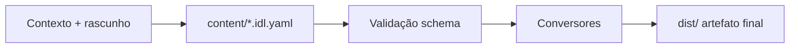

# Material Didático — Pipeline IDL → Entrega

Projeto para construir material didático em um **formato intermediário** (IDL) e, depois, gerar um **artefato final leve** que abra bem em iOS, Android e desktop.

## Fluxo



1. **Contexto** — arquivos de referência em `context/` (você envia aqui).
2. **Construção** — edição do material em `content/` no formato IDL (YAML estruturado).
3. **Validação** — `npm run validate` confere o IDL contra `schemas/`.
4. **Build** — `npm run build` gera o pacote em `dist/` (formato final a definir no prompt).

## Pastas

| Pasta | Uso |
|-------|-----|
| `context/` | Arquivos de contexto do projeto (briefing, referências, anexos) |
| `prompts/` | Prompt inicial e instruções para o agente |
| `content/` | Fonte do material em IDL |
| `schemas/` | Contrato JSON Schema do IDL |
| `src/` | Pipeline (parse, validação, conversores) |
| `dist/` | Saída gerada (não versionar) |
| `docs/` | Documentação do formato e do pipeline |

## Próximos passos

1. Coloque seus arquivos de contexto em `context/`.
2. Coloque o prompt completo em `prompts/inicial.md` (ou anexe na conversa).
3. Definiremos juntos o **formato final** (ex.: HTML único offline, EPUB, etc.) e implementaremos o conversor em `src/converters/`.

## Comandos

```bash
npm install
npm run validate
npm run build
```
